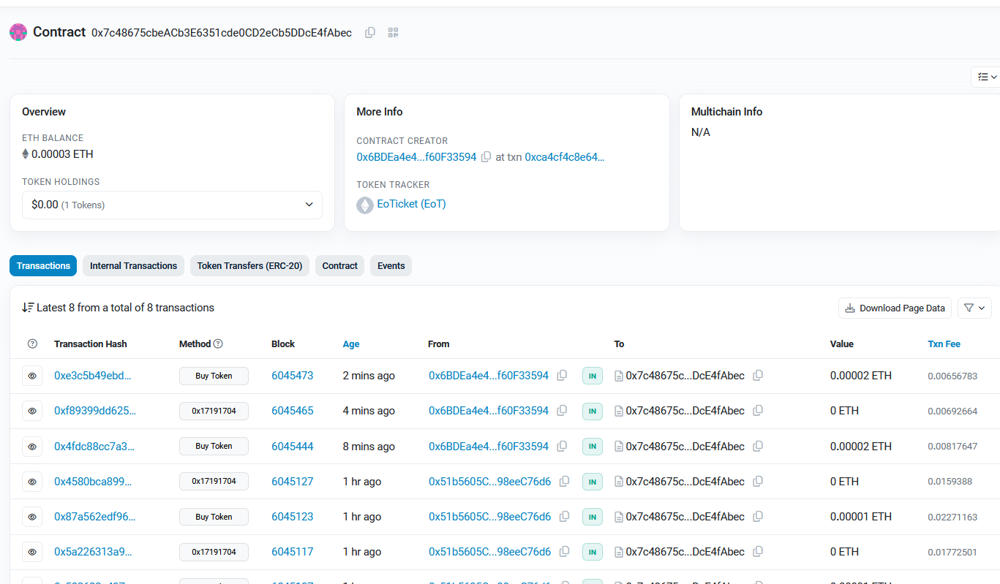
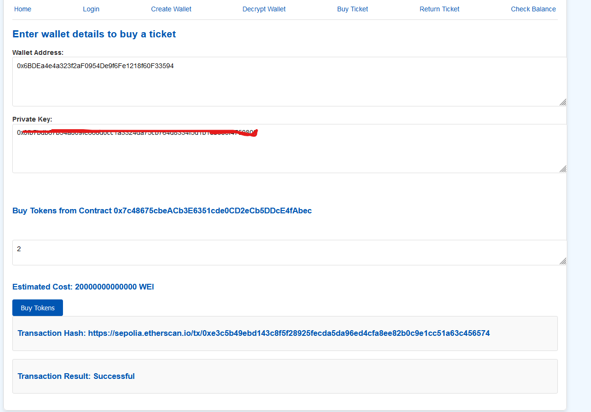
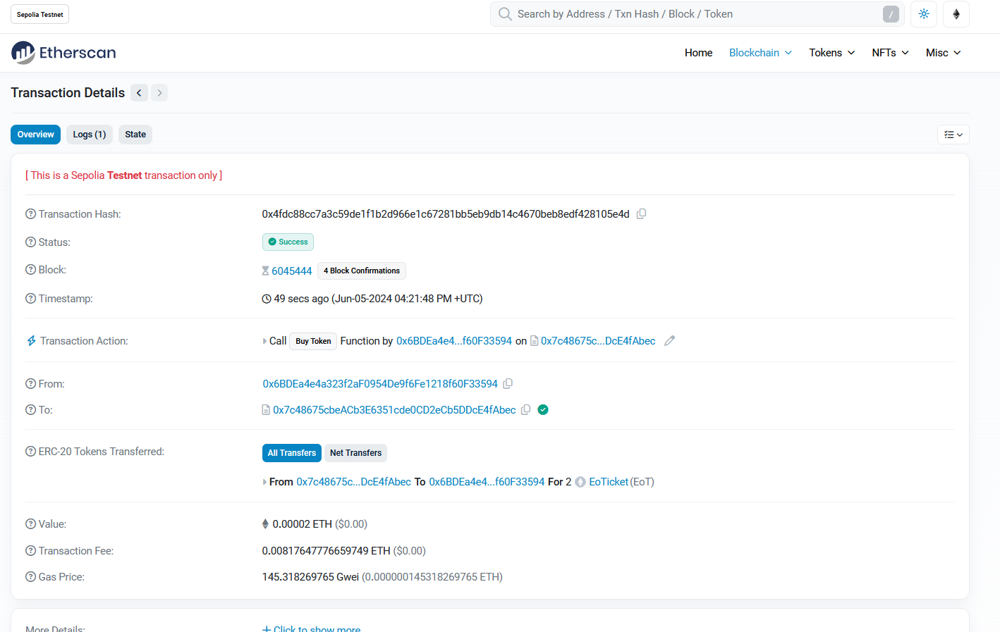
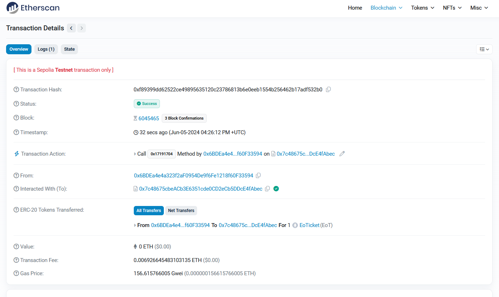
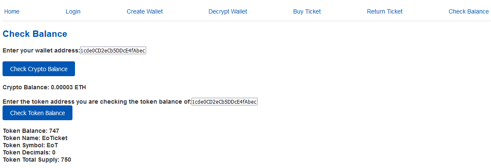
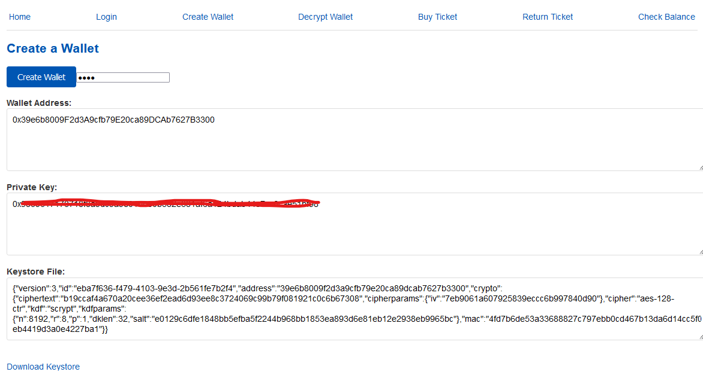
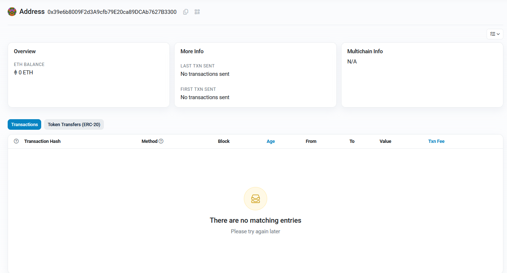
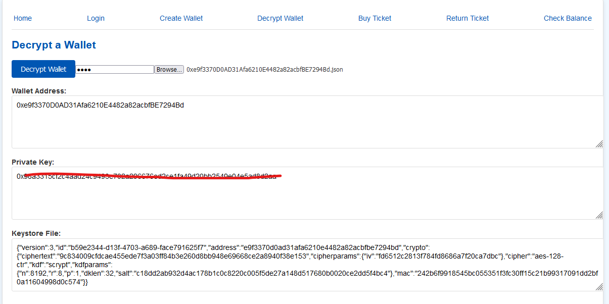

# Blockchain-Project
Web3 distributed app implementing a simple ticketing system using ERC-20 tokens on the Sepolia Network. Made as part of CS4455 in ISE as a submission by Eoghan OMahony 22362975

Contract was deployed on the sepolia network https://sepolia.etherscan.io/address/0x7c48675cbeACb3E6351cde0CD2eCb5DDcE4fAbec

## Login
Users can log in as either a customer, vendor or a doorman

## Buy Tickets
Users can buy tickets from the contract

A successful purchase returns a hash of the transaction to allow the user to be able to view it on etherscan
https://sepolia.etherscan.io/tx/0x4fdc88cc7a3c59de1f1b2d966e1c67281bb5eb9db14c4670beb8edf428105e4d

## Return Tickets
Users can return tickets to the contract

The ticket value is returned to their wallet, minus the gas fee paid during purchase and refund

If the user has less tickets than they are attempting to refund currently in their wallet they are unable to begin the transaction

https://sepolia.etherscan.io/tx/0xf89399dd62522ce49895635120c23786813b6e0eeb1554b256462b17adf532b0

## Check Balance
Users can check their crypto and ticket balance
- This allows customers to confirm the success of transactions
- It also allows a doorman to enter the wallet address of an attendee to check if they have a ticket

- It also allows the vendor to see the total supply and the distribution

## Create Wallet
Users can create a new wallet and download its keystore

It is then added to the sepolia network

## Decrypt Wallet
If a user loses access to their wallet address or private key they can upload the keystore to decrypt their wallet

