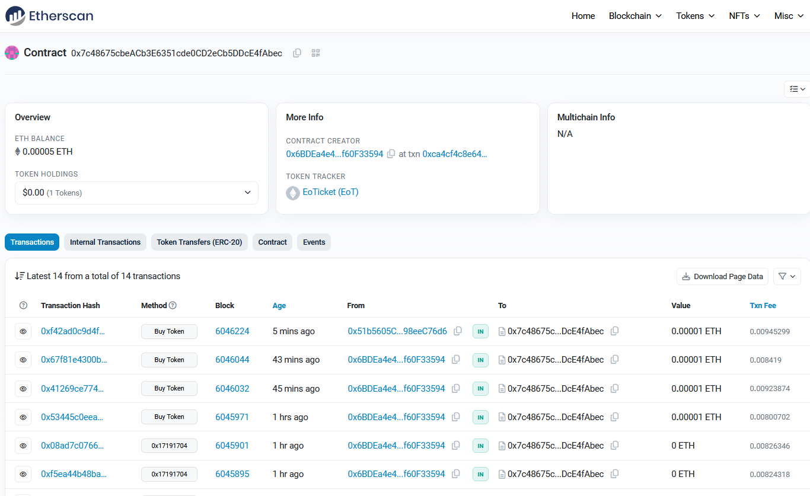
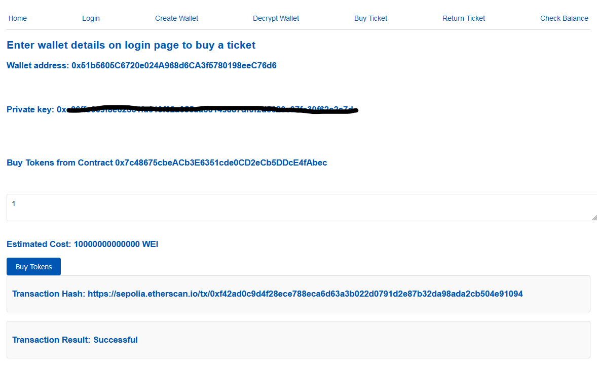
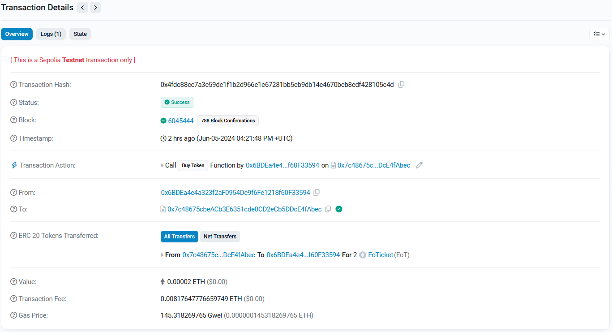
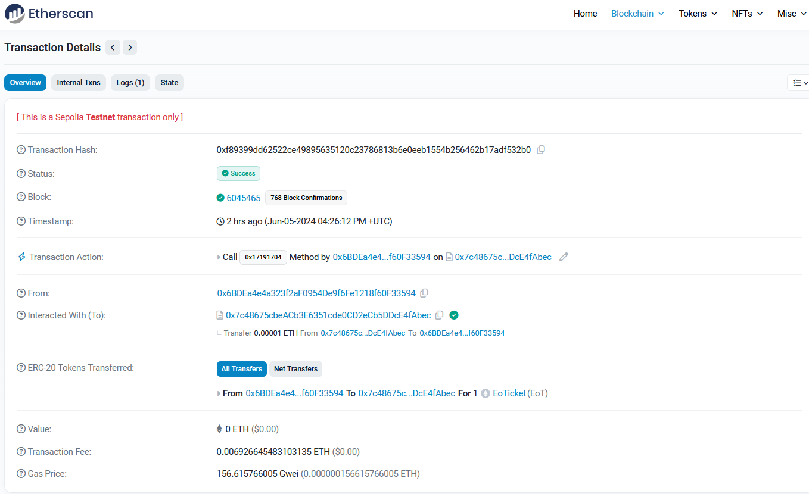
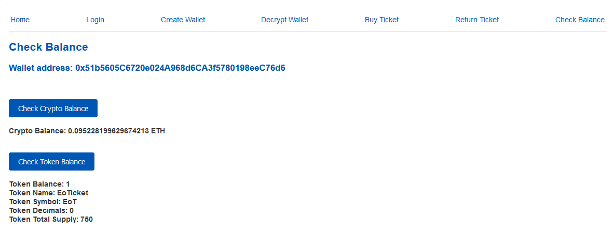
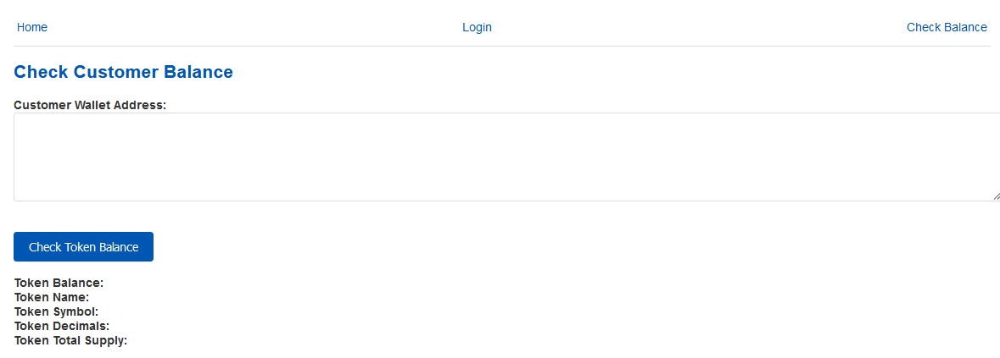
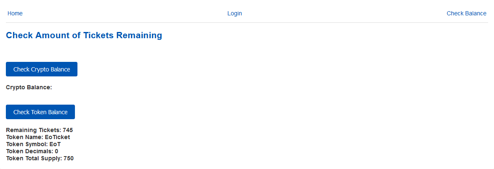
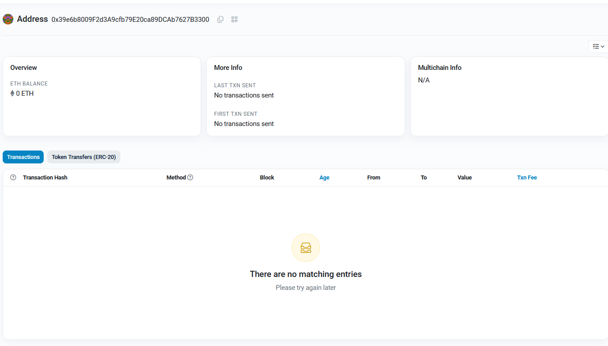

# Blockchain-Project
Web3 distributed app implementing a simple ticketing system using ERC-20 tokens on the Sepolia Network. Made as part of CS4455 in ISE as a submission by Eoghan OMahony 22362975

Contract was deployed on the sepolia network https://sepolia.etherscan.io/address/0x7c48675cbeACb3E6351cde0CD2eCb5DDcE4fAbec


## Running
To run the code you must start the proxy server to avoid CORS errors
```
node ./src/Middleware.js
```

You can then run the web page using 
```
npm run start
```

## Overview
### Login
Users can log in as either a customer, vendor or a doorman


### Buy Tickets
- Users can buy tickets from the contract



- A successful purchase returns a hash of the transaction to allow the user to be able to view it on etherscan
https://sepolia.etherscan.io/tx/0x4fdc88cc7a3c59de1f1b2d966e1c67281bb5eb9db14c4670beb8edf428105e4d



### Return Tickets
- Users can return tickets to the contract

- The ticket value is returned to their wallet, minus the gas fee paid during purchase and refund

- If the user has less tickets than they are attempting to refund currently in their wallet they are unable to begin the transaction

https://sepolia.etherscan.io/tx/0xf89399dd62522ce49895635120c23786813b6e0eeb1554b256462b17adf532b0



### Check Balance
Users can check their crypto and ticket balance
- This allows customers to confirm the success of transactions



- It also allows a doorman to enter the wallet address of an attendee to check if they have a ticket



- It also allows the vendor to see the total supply and the distribution



### Create Wallet
- Users can create a new wallet and download its keystore
- It is then added to the sepolia network



### Decrypt Wallet
- If a user loses access to their wallet address or private key they can upload the keystore to decrypt their wallet

## Code Overview
- The project is built using React
- Each page extends React.component allowing it to be render as a view component
- When buttons are clicked they call a function

- Eg. Buy Token
```javascript
const web3 = new Web3("http://localhost:3030/api");
    const contractAddress = useContext(AppContext).tokenAddress;
    const ABI = abi;
    const contract = new web3.eth.Contract(ABI, contractAddress);
    const privateKey = useContext(AppContext).privateKey;
    const walletAddress = useContext(AppContext).walletAddress;


    const buyTokens = async () => {          
        const amountToBuy = document.getElementById('amountToBuy').value;

        if (!privateKey || !amountToBuy || !walletAddress) {
            alert('Please enter wallet address, private key and amount to buy');
            return;
        }
        console.log(privateKey);
        console.log(amountToBuy);
        try{
            // Show the loading block to give visual feedback to the user
            document.getElementById('Loading').style.display = "block";

            // Get the wallet from the private key
            const wallet = web3.eth.accounts.privateKeyToAccount(privateKey);

            // Check if the wallet address is the same as the one entered by the user to prevent errors
            if (!wallet || wallet.address !== walletAddress) {
                alert('Invalid private key');
                return;
            }
            
            // Get the token value from the contract to calculate the cost
            const tokenValue = await contract.methods.tokenCost().call();

            // Use the buyToken function in the contract ABI
            const transaction = contract.methods.buyToken();
            const encodedABI = transaction.encodeABI();

            // Get the current gas price
            const gasPriceEstimate = await web3.eth.getGasPrice();

            // Create the transaction object
            const tx = {
                from: wallet.address,
                to: contractAddress,
                // Set the gas limit to 200,000
                gas: web3.utils.toHex(200000),
                // Set the gas price to 1.5 times the current gas price to speed up the transaction
                gasPrice: web3.utils.toHex(gasPriceEstimate * 12n),
                data: encodedABI,
                // Multiply the amount of tokens wanted by the value of each token
                value: amountToBuy * Number(tokenValue),
            };
            console.log(tx);

            // Sign the transaction with the private key
            web3.eth.accounts.signTransaction(tx, privateKey).then((signedTransaction) => {
                // Send the signed transaction
                web3.eth.sendSignedTransaction(signedTransaction.rawTransaction).on("transactionHash", (hash) => {
                    // Log the transaction hash and link it to etherscan
                    console.log(`Transaction hash: ${hash}`);
                    document.getElementById('transactionHash').innerHTML = `<h3>Transaction Hash: <a href="https://sepolia.etherscan.io/tx/${hash}" target="_blank">https://sepolia.etherscan.io/tx/${hash}</a></h3>`;
                }).on('receipt', (receipt) => {
                    // Log the receipt
                    console.log(receipt);
                    // Display whether the transaction was successful or not
                    document.getElementById('transactionResult').innerHTML = `<h3>Transaction Result: Successful</h3>`;
                    // Hide the loading block
                    document.getElementById('Loading').style.display = "none";
                }).on("error", (error) => {
                    // Log the error
                    console.log(error);
                    // Display the error message
                    document.getElementById('transactionResult').innerHTML = `<h3>Transaction Result: ${error.message}</h3>`;
                    // Hide the loading block
                    document.getElementById('Loading').style.display = "none";
                });
            });
        } catch (error) {
            console.log(error);
            document.getElementById('transactionResult').innerHTML = `<h3>Transaction Result: ${error.message}</h3>`;
        }

    }
```
- This code is called when the buy token button is clicked
- It uses the proxy server to create an instance of web3

```web3 = new Web3("http://localhost:3030/api");```
- It then uses this for its JsonRPC requests. It uses an ABI defined in ./src/components/abi.json to get the contract methods from the deployed contract
- It uses the app context returned from AppContext.js
```javascript
import { useState } from 'react';
import { createContext } from 'react';

const AppContext = createContext();

export const AppProvider = ({ children }) => {
    const tokenAddress = "0x7c48675cbeACb3E6351cde0CD2eCb5DDcE4fAbec";
    const [walletAddress, setWalletAddress] = useState('');
    const [userType, setUserType] = useState('customer');
    const [privateKey, setPrivateKey] = useState('');
    return (
      <AppContext.Provider value={{tokenAddress, walletAddress, setWalletAddress, userType, setUserType, privateKey, setPrivateKey }}>
        {children}
      </AppContext.Provider>
    );
};


export default AppContext;
```
- This allows the user to enter their wallet address once on the login page and it can be accessed from other pages such as this buy ticket page
- It encodes the method from the abi and then sets the parameters such as gas, gasPrice and any other parameters required by the function, in this case the amount being paid
- It then signs this transaction using its private key and sends the jsonRPC request through the proxy server
- When it receives the transaction hash response it links it so that the user can view the transaction on etherscan
- When the transaction result is returned it then displays this to the user

A similar structure is used in all of the pages to provide the above functionality
